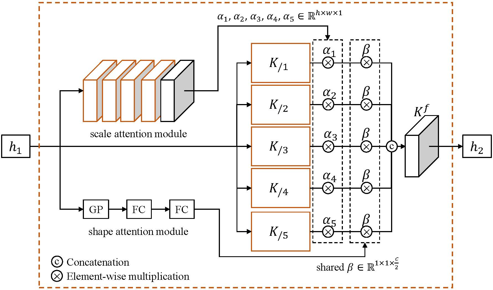

# KPAC: Kernel-Sharing Parallel Atrous Convolutional block


<p align="center">
   
</p>

This repository contains the official Tensorflow implementation of the following paper:

> **[Single Image Defocus Deblurring Using Kernel-Sharing Parallel Atrous Convolutions](https://arxiv.org/abs/2108.09108)**<br>
> Hyeongseok Son, Junyong Lee, Sunghyun Cho, Seungyong Lee, ICCV 2021


## Getting Started
### Prerequisites
*Tested environment*


**Pre-trained models**

        ```
        ├── ./pretrained
        │   ├── single_2level.npz
        │   ├── single_3level.npz
        │   ├── dual.npz
        ```

## Testing models of ICCV2021

```shell
# Our 2-level model 
CUDA_VISIBLE_DEVICES=0 python main_eval_2level.py

# Our 3-level model 
CUDA_VISIBLE_DEVICES=0 python main_eval_3level.py

# Our dual pixel-based model
CUDA_VISIBLE_DEVICES=0 python main_eval_dual.py
```


## Citation
If you find this code useful, please consider citing:
```
@InProceedings{Son_2021_ICCV,
    author = {Son, Hyeongseok and Lee, Junyong and Cho, Sunghyun and Lee, Seungyong},
    title = {Single Image Defocus Deblurring Using Kernel-Sharing Parallel Atrous Convolutions},
    journal = {Proc. ICCV},
    year = {2021}
}
```

## Contact
Open an issue for any inquiries.
You may also have contact with [sonhs@postech.ac.kr](mailto:sonhs@postech.ac.kr)

## License
This software is being made available under the terms in the [LICENSE](LICENSE) file.

Any exemptions to these terms require a license from the Pohang University of Science and Technology.

## About Coupe Project
Project ‘COUPE’ aims to develop software that evaluates and improves the quality of images and videos based on big visual data. To achieve the goal, we extract sharpness, color, composition features from images and develop technologies for restoring and improving by using them. In addition, personalization technology through user reference analysis is under study.  
    
Please checkout other Coupe repositories in our [Posgraph](https://github.com/posgraph) github organization.

### Useful Links
* [Coupe Library](http://coupe.postech.ac.kr/)
* [POSTECH CG Lab.](http://cg.postech.ac.kr/)
